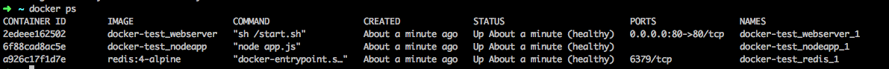
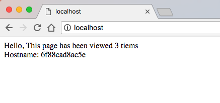

# Chegg Ops - Counter app

This repo contains a simple counter application with 3 components:

1. Node Application
2. Nginx webserver
3. Redis database

The task should setup a local environment containing all Counter app components, in an easy and reproducible manner.

**Requirements:**
1. Prepare appropriate Dockerfiles for the application and webserver.
2. Create a compose file that will run the application.

To acheive this, you can use docker-compose, docker swarm stack or any other tool of your choosing.

You'll
Feel free enhancing the solution with any utility serivces (e.g. some basic monitoring) you see fit.

### Result
Running all dockers together should result with:

Server will return the following on successful response:

Good Luck,
Chegg
